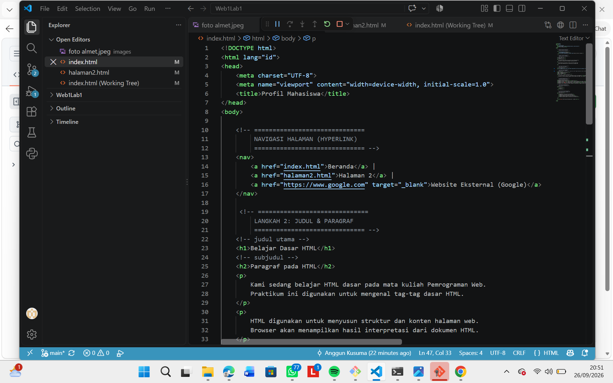
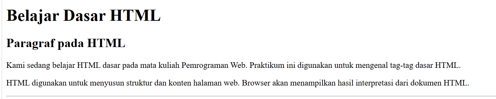
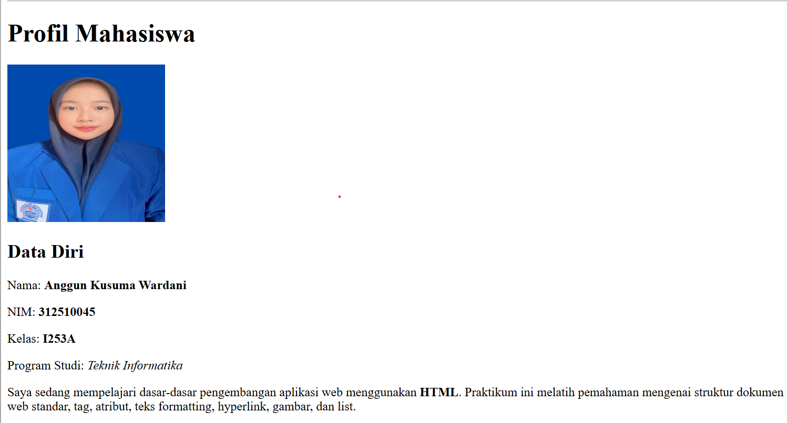
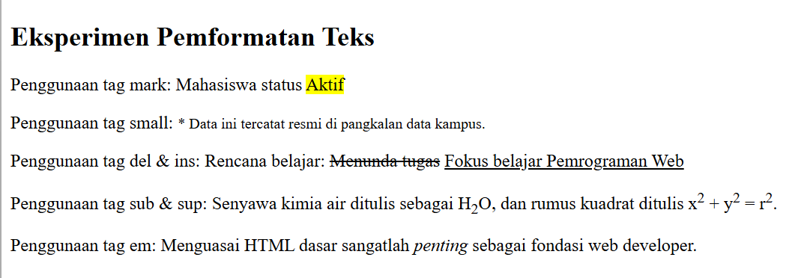
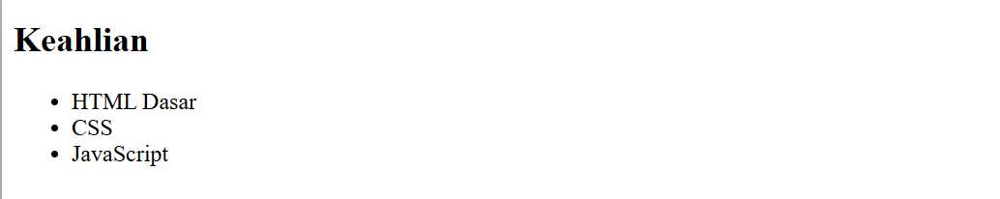
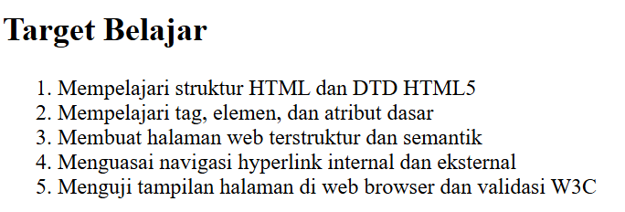
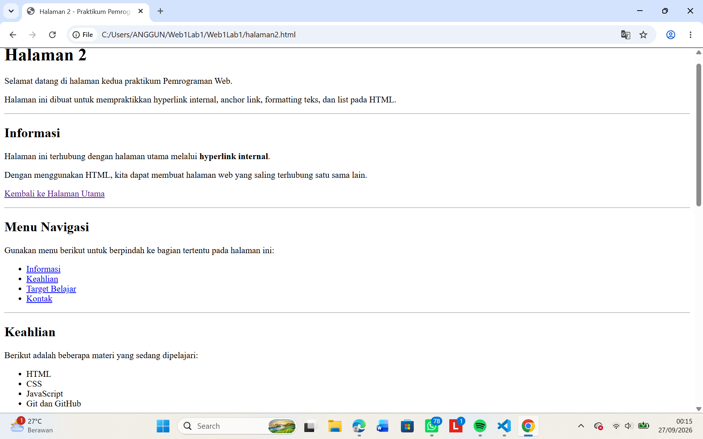
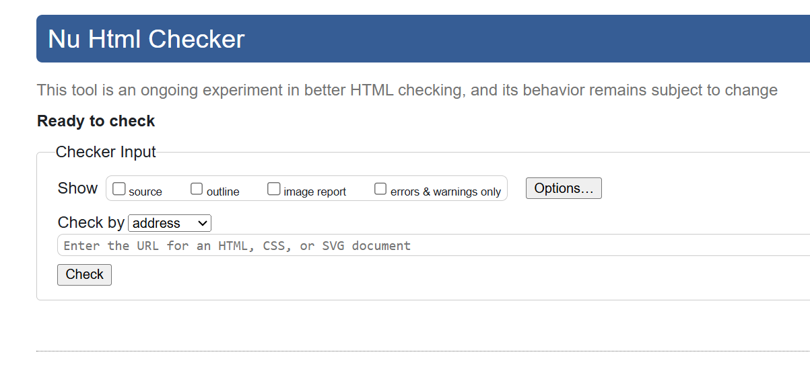

# Web1Lab1
Repository ini dibuat untuk memenuhi tugas Praktikum 1 - HTML Dasar pada mata kuliah Pemrograman Web.

Identitas Mahasiswa:

Nama: Anggun Kusuma Wardani
NIM: 312510045
Kelas: I253A
Program Studi: Teknik Informatika
Dosen Pengampu: Agung Nugroho, S.Kom., M.Kom.
Kampus: Universitas Pelita Bangsa

# Panduan Screenshot Tugas

Simpan semua file tangkapan layar (screenshot) di dalam folder `screenshots/` dengan format nama angka (`1.png` sampai `8.png`) sesuai tabel berikut:

| No File | Aplikasi / Lokasi | Yang Harus Di-Screenshot |
|---|---|---|
| `1.png` | VS Code (Editor) | Kode struktur dasar HTML5 pada `index.html` (`<!DOCTYPE html>`, `<html>`, `<head>`, `<body>`). |
| `2.png` | Browser | Tampilan heading `<h1>`, `<h2>`, dan teks paragraf `
` di browser. |
| `3.png` | Browser | Tampilan gambar foto profil mahasiswa (`images/profil.jpg`) dengan lebar 200px. |
| `4.png` | Browser |  Tampilan hasil pemformatan teks (`<b>`, `<i>`, `<mark>`, ``, ``, `<del>`, `<ins>`). |
| `5.png` | Browser | Tampilan Unordered List (`<ul>` keahlian). |
| `6.png` | Browser | Tampilan Ordered List (`<ol>` target belajar). |
| `7.png` | Browser | Tampilan file `halaman2.html` yang menunjukkan navigasi link dan anchor link. |
| `8.png` | VS Code / Browser | Tampilan hasil akhir project dan dokumentasi project. |

Langkah Pengerjaan Praktikum
1. Membuat Struktur Dasar HTML

Langkah pertama adalah membuat dokumen HTML dengan struktur dasar HTML5. Struktur tersebut terdiri dari deklarasi <!DOCTYPE html>, elemen <html>, bagian <head>, dan bagian <body>.

Contoh struktur yang digunakan:

<!DOCTYPE html>
<html lang="id">

<head>
    <meta charset="UTF-8">
    <meta name="viewport" content="width=device-width, initial-scale=1.0">
    <title>Profil Mahasiswa</title>
</head>

<body>

</body>

</html>

<!DOCTYPE html> digunakan untuk menentukan bahwa dokumen menggunakan HTML5. Elemen <html> menjadi pembungkus seluruh dokumen, <head> menyimpan informasi halaman, sedangkan <body> merupakan tempat seluruh konten halaman ditampilkan.

### Hasil Screenshot

2. Membuat Heading dan Paragraf

Setelah struktur dasar dibuat, langkah berikutnya adalah menambahkan heading dan paragraf. Heading digunakan sebagai judul atau subjudul, sedangkan paragraf digunakan untuk menampilkan informasi dalam bentuk teks.

Contoh penggunaan:

<h1>Belajar Dasar HTML</h1>

<h2>Paragraf pada HTML</h2>

    Kami sedang belajar HTML dasar pada mata kuliah Pemrograman Web.
    Praktikum ini digunakan untuk memahami elemen-elemen dasar HTML.

    HTML digunakan untuk membangun struktur dan isi sebuah halaman web.

Tag <h1> digunakan sebagai judul utama dan <h2> sebagai subjudul. Sementara itu, tag 
 digunakan untuk membuat paragraf.

### Hasil Screenshot

3. Menampilkan Gambar

Materi berikutnya adalah menampilkan gambar pada halaman web menggunakan elemen . Gambar pada project disimpan di dalam folder images.

Contoh penggunaannya:

<h2>Foto Profil</h2>

Atribut src digunakan untuk menentukan lokasi file gambar. width dan height digunakan untuk mengatur ukuran gambar. Atribut alt memberikan keterangan alternatif apabila gambar tidak berhasil dimuat, sedangkan title memberikan informasi tambahan ketika kursor diarahkan ke gambar.

### Hasil Screenshot

4. Menerapkan Formatting Teks

HTML menyediakan beberapa elemen untuk memberikan tampilan atau penekanan tertentu pada teks. Dalam praktikum ini digunakan beberapa tag formatting seperti <b>, <strong>, <i>, <em>, <mark>, <small>, <del>, <ins>, , dan .

Contoh:

    Belajar <b>HTML Dasar</b> pada mata kuliah
    <i>Pemrograman Web</i>.

    HTML merupakan <strong>bahasa markup</strong>
    yang digunakan untuk membuat halaman web.

Status: <mark>Aktif</mark>

    <del>Menunda pekerjaan</del>
    <ins>Rajin mengerjakan tugas</ins>

    Contoh rumus: H2O

    Contoh pangkat: x2

Tag <b> membuat teks tebal, <i> membuat teks miring, <mark> memberikan highlight, <del> memberikan garis coret, <ins> menunjukkan teks yang ditambahkan,  membuat tulisan menjadi subscript, dan  membuat tulisan menjadi superscript.

### Hasil Screenshot

5. Membuat Unordered List

List digunakan untuk menampilkan beberapa informasi dalam bentuk daftar. HTML memiliki dua jenis list yang digunakan dalam project ini, yaitu unordered list dan ordered list.

Unordered List

Unordered list menggunakan tag <ul> dan <li>.

<h2>Keahlian</h2>

<ul>
    <li>HTML</li>
    <li>CSS</li>
    <li>JavaScript</li>
    <li>Git dan GitHub</li>
</ul>

Unordered list menampilkan item menggunakan tanda bullet sehingga cocok digunakan untuk daftar yang tidak membutuhkan urutan tertentu.

### Hasil Screenshot

6. Membuat Ordered List

Ordered list menggunakan tag <ol> dan <li>.

<h2>Target Belajar</h2>

<ol>
    <li>Memahami struktur HTML</li>
    <li>Mengenal tag dan atribut</li>
    <li>Membuat halaman web</li>
    <li>Menguji halaman menggunakan browser</li>
    <li>Melakukan validasi HTML</li>
</ol>

Ordered list menampilkan item menggunakan nomor sehingga cocok digunakan untuk daftar yang memiliki urutan.

### Hasil Screenshot

7. Membuat Hyperlink dan Navigasi

Hyperlink digunakan untuk menghubungkan halaman web. Pada project ini dibuat hubungan antara index.html dan halaman2.html.

Contoh link menuju halaman kedua:

<a href="halaman2.html">Halaman 2</a>

Sedangkan pada halaman kedua terdapat link untuk kembali:

<a href="index.html">Kembali ke Halaman Utama</a>

Selain link internal, project juga dapat menggunakan hyperlink eksternal untuk membuka website lain.

Contoh:

<a href="https://www.google.com" target="_blank">
    Website Eksternal
</a>

Atribut target="_blank" digunakan agar halaman tujuan dibuka pada tab baru.

### Hasil Screenshot

8. HTML Menggunakan W3C

Setelah halaman selesai dibuat, dilakukan pemeriksaan terhadap kode HTML menggunakan Nu Html Checker dari W3C. Validasi dilakukan untuk mengetahui apakah terdapat kesalahan pada struktur atau sintaks HTML.

Langkah:

Membuka Nu Html Checker.
Memilih opsi File Upload.
Memilih file index.html.
Menekan tombol Check.
Memeriksa hasil pemeriksaan yang ditampilkan.
Memperbaiki kode jika ditemukan error.
Mengambil screenshot hasil validasi sebagai dokumentasi.

Validasi ini membantu memastikan bahwa dokumen HTML yang dibuat telah mengikuti struktur HTML yang benar.

### Hasil Screenshot

Kesimpulan

Praktikum HTML Dasar memberikan pemahaman mengenai cara membangun sebuah halaman web menggunakan HTML5. Materi yang dipraktikkan meliputi struktur dasar HTML, heading, paragraf, formatting teks, gambar, hyperlink internal dan eksternal, anchor link, unordered list, ordered list, navigasi, serta validasi HTML. Seluruh materi tersebut kemudian diterapkan pada index.html dan halaman2.html. Hasil pengerjaan didokumentasikan melalui screenshot dan disimpan dalam repository GitHub. Melalui praktikum ini, dapat dipahami bahwa HTML berperan sebagai dasar dalam menyusun struktur dan konten sebuah halaman web sebelum dikembangkan lebih lanjut menggunakan CSS dan JavaScript.
